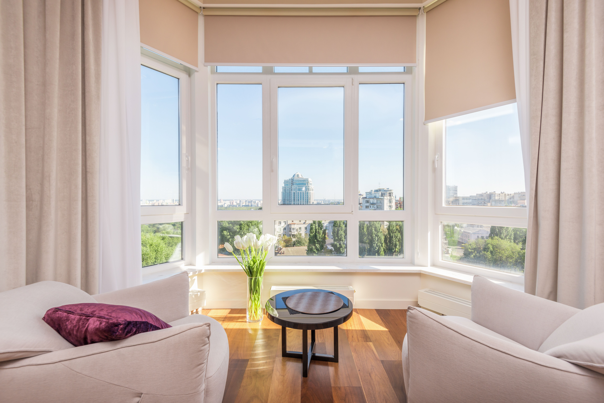
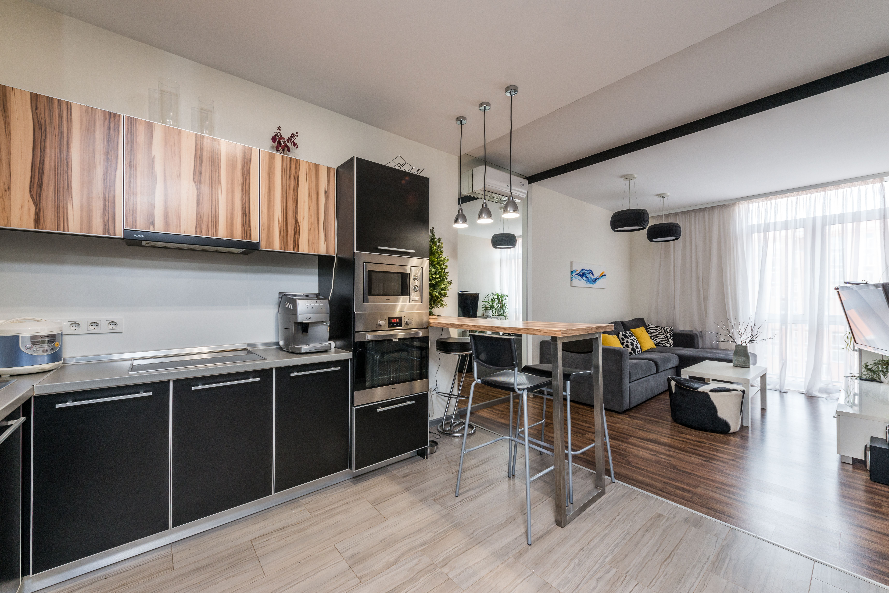
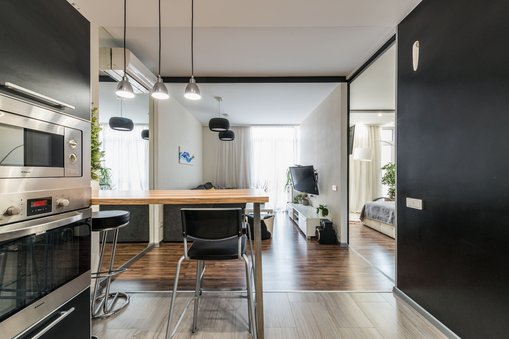
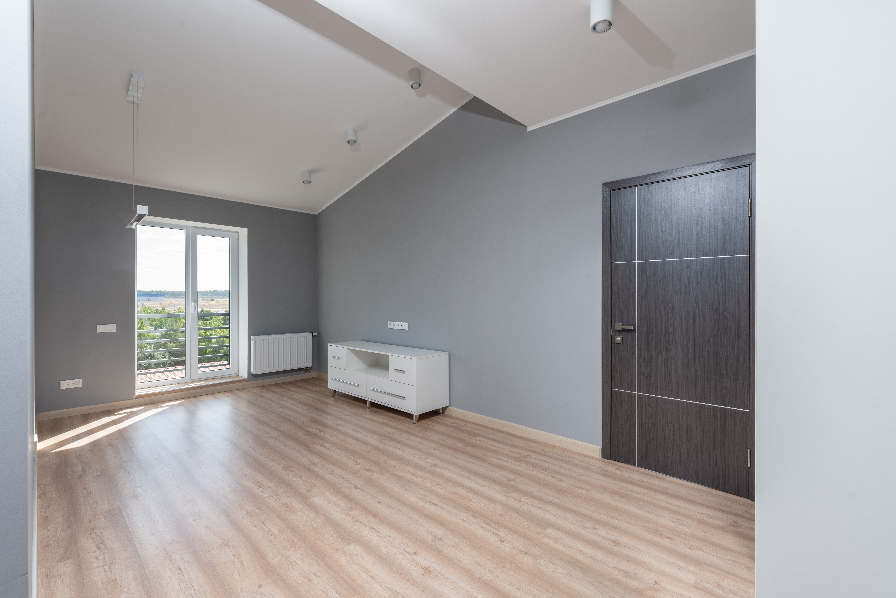
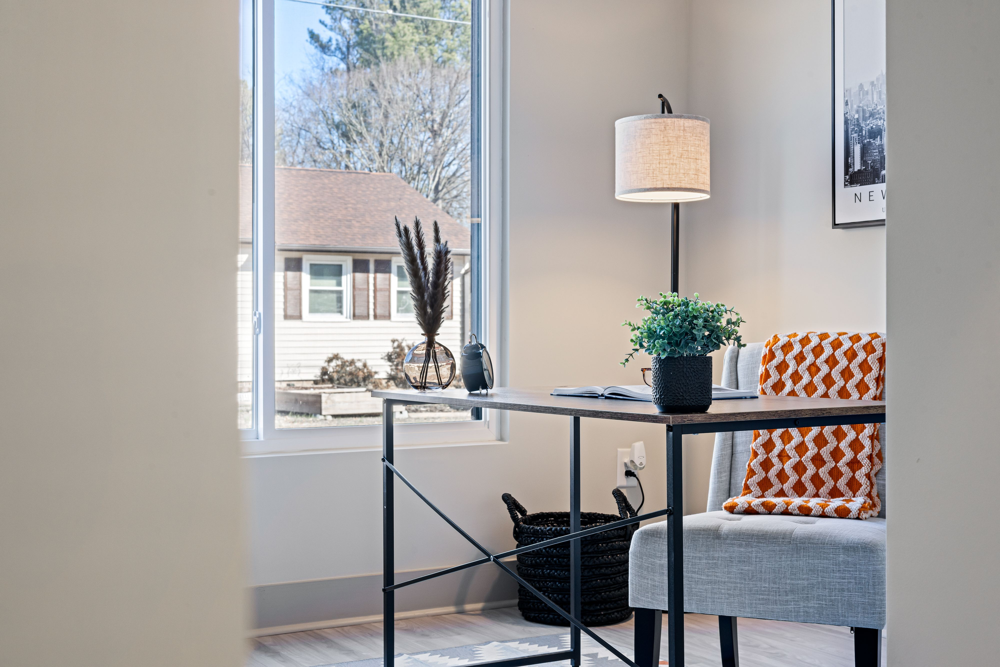
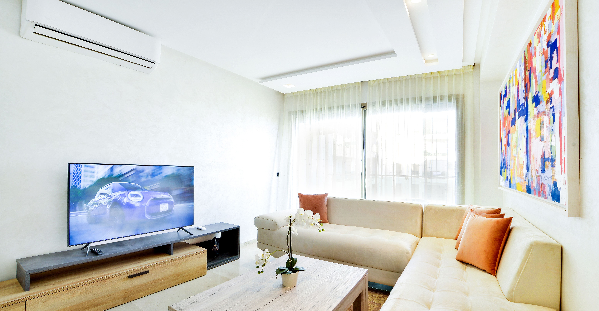

[index.html](https://github.com/user-attachments/files/30125886/index.html)
<!doctype html>
<html lang="ru">
<head>
  <meta charset="UTF-8" />
  <meta name="viewport" content="width=device-width, initial-scale=1.0" />
  <title>РемонтПро — ремонт квартир в Москве и области</title>
  <meta name="description" content="Ремонт квартир в Москве и области: смета за 24 часа, договор, гарантия 12 месяцев." />

  <link rel="preconnect" href="https://fonts.googleapis.com">
  <link rel="preconnect" href="https://fonts.gstatic.com" crossorigin>
  <link href="https://fonts.googleapis.com/css2?family=Inter:wght@400;600;700&display=swap" rel="stylesheet">

  <link rel="stylesheet" href="style.css" />
</head>

<body>
  <header class="header">
    

      <a class="logo" href="#top">РемонтПро</a>[style.css](https://github.com/user-attachments/files/30125938/style.css)

      <nav class="nav" aria-label="Навигация">
        <a href="#services">Услуги</a>
        <a href="#works">Работы</a>
        <a href="#prices">Цены</a>
        <a href="#reviews">Отзывы</a>
        <a href="#contacts">Контакты</a>
      </nav>

      <a class="btn btn--ghost" href="tel:+79990000000">Позвонить</a>
    

  </header>

  <main id="top">
    <!-- HERO -->
    <section class="hero">
      

      

        

          <h1>Ремонт квартир в Москве и области — под ключ и частично</h1>
          

            Смета за 24 часа. Договор. Гарантия 12 месяцев.
            Работаем аккуратно и по срокам.
          

          <ul class="bullets">
            <li>Смета и сроки фиксируем в договоре</li>
            <li>Закупка материалов и доставка — по желанию</li>
            <li>Фотоотчёт по этапам</li>
          </ul>

          

            <a class="btn btn--primary" href="#contacts">Рассчитать стоимость</a>
            <a class="btn btn--ghost" href="#works">Посмотреть работы</a>
          

          

            <strong>Телефон:</strong> <a href="tel:+79990000000">+7 (999) 000‑00‑00</a> 
            <strong>Email:</strong> <a href="mailto:test@example.com">test@example.com</a>
          

        

        

          <h2>Быстрый расчёт</h2>
          
Оставьте контакты — перезвоним и уточним детали.

          <form class="form" action="#" method="post">
            <label>
              Имя
              <input type="text" name="name" placeholder="Как к вам обращаться" required />
            </label>

            <label>
              Телефон
              <input type="tel" name="phone" placeholder="+7 (___) ___-__-__" required />
            </label>

            <button class="btn btn--primary" type="submit">Отправить</button>
            
Форма без отправки (тестовый режим).

          </form>
        

      

    </section>

    <!-- SERVICES -->
    <section id="services" class="section">
      

        

          <h2>Услуги</h2>
          
Делаем полный цикл работ и отдельные этапы.

        

        

          <article class="card"><h3>Демонтаж и подготовка</h3>
Снятие старых покрытий, вынос мусора.
</article>
          <article class="card"><h3>Электрика и сантехника</h3>
Разводка, замена, аккуратный монтаж.
</article>
          <article class="card"><h3>Штукатурка и шпаклёвка</h3>
Ровные стены под покраску/обои.
</article>
          <article class="card"><h3>Плитка и санузлы</h3>
Укладка плитки, гидроизоляция.
</article>
          <article class="card"><h3>Полы и потолки</h3>
Стяжка, ламинат, натяжные/ГКЛ.
</article>
          <article class="card"><h3>Покраска и обои</h3>
Финишная отделка и аккуратные стыки.
</article>
        

      

    </section>

    <!-- WORKS -->
    <section id="works" class="section section--alt">
      

        

          <h2>Работы</h2>
          
Примеры объектов и деталей.

        

        

          
          
          
          
          
          
        

      

    </section>

    <!-- PRICES -->
    <section id="prices" class="section">
      

        

          <h2>Цены</h2>
          
Ориентиры. Точную стоимость считаем по площади и работам.

        

        

          <article class="price__card">
            <h3>Косметический</h3>
            
от 4 900 ₽/м²

            <ul>
              <li>Обои / покраска</li>
              <li>Полы</li>
              <li>Мелкие работы</li>
            </ul>
            <a class="btn btn--ghost" href="#contacts">Уточнить</a>
          </article>

          <article class="price__card price__card--best">
            
Популярно

            <h3>Капитальный</h3>
            
от 9 900 ₽/м²

            <ul>
              <li>Черновые работы</li>
              <li>Электрика</li>
              <li>Сантехника</li>
            </ul>
            <a class="btn btn--primary" href="#contacts">Рассчитать</a>
          </article>

          <article class="price__card">
            <h3>Под ключ</h3>
            
от 14 900 ₽/м²

            <ul>
              <li>Полный цикл</li>
              <li>Координация</li>
              <li>Контроль качества</li>
            </ul>
            <a class="btn btn--ghost" href="#contacts">Рассчитать</a>
          </article>
        

      

    </section>

    <!-- REVIEWS -->
    <section id="reviews" class="section section--alt">
      

        

          <h2>Отзывы</h2>
          
Несколько реальных впечатлений клиентов.

        

        

          <article class="review">
            
“Сделали санузел и кухню, всё ровно, сроки соблюли.”

            
Анна

          </article>
          <article class="review">
            
“Понравилась смета и фотоотчёт, без сюрпризов по оплате.”

            
Сергей

          </article>
          <article class="review">
            
“Аккуратно, после себя убрали, результат отличный.”

            
Марина

          </article>
        

      

    </section>

    <!-- CONTACTS -->
    <section id="contacts" class="section">
      

        

          <h2>Контакты</h2>
          
Связь и заявка на расчёт.

        

        

          

            <h3>Как связаться</h3>
            

              Тел: <a href="tel:+79990000000">+7 (999) 000‑00‑00</a> 
              WhatsApp/Telegram: <a href="tel:+79990000000">+7 (999) 000‑00‑00</a> 
              Email: <a href="mailto:test@example.com">test@example.com</a> 
              Город: Москва и область
            

          

          

            <h3>Заявка</h3>
            <form class="form" action="#" method="post">
              <label>Имя <input type="text" name="name" placeholder="Имя" required /></label>
              <label>Телефон <input type="tel" name="phone" placeholder="+7 (___) ___-__-__" required /></label>
              <label>Комментарий <textarea name="msg" rows="4" placeholder="Что нужно сделать?"></textarea></label>
              <button class="btn btn--primary" type="submit">Отправить</button>
              
Форма без отправки (тестовый режим).

            </form>
          

        

      

    </section>
  </main>

  <footer class="footer">
    

      
©  РемонтПро

      
<a href="tel:+79990000000">+7 (999) 000‑00‑00</a>

      
<a href="mailto:test@example.com">test@example.com</a>

    

  </footer>

  
</body>
</html>:root{
  --text:#0f172a;
  --muted:#64748b;
  --line:#e5e7eb;
  --card:#fff;
  --bg:#ffffff;
  --alt:#f8fafc;
  --primary:#2f5cff;
  --primary2:#2448d8;
}

*{ box-sizing:border-box; }
html{ scroll-behavior:smooth; }
body{
  margin:0;
  font-family:Inter, system-ui, -apple-system, Segoe UI, Roboto, Arial, sans-serif;
  color:var(--text);
  background:var(--bg);
  line-height:1.5;
}
a{ color:inherit; }

.container{ max-width:1100px; margin:0 auto; padding:0 16px; }
.muted{ color:var(--muted); }
.small{ font-size:13px; }

/* Header */
.header{
  position:sticky; top:0; z-index:10;
  background:rgba(255,255,255,.92);
  backdrop-filter: blur(10px);
  border-bottom:1px solid var(--line);
}
.header__row{
  min-height:66px;
  display:flex; align-items:center; justify-content:space-between;
  gap:14px;
}
.logo{
  font-weight:800; text-decoration:none;
  font-size:18px; white-space:nowrap;
}
.logo span{ color:var(--primary); }
.nav{
  display:flex; gap:10px; flex-wrap:wrap;
}
.nav a{
  text-decoration:none;
  padding:8px 10px;
  border-radius:10px;
  font-weight:700;
  font-size:14px;
}
.nav a:hover{ background:#f1f5f9; }

.btn{
  display:inline-flex; align-items:center; justify-content:center;
  padding:10px 14px;
  border-radius:12px;
  border:1px solid transparent;
  text-decoration:none;
  font-weight:800;
  cursor:pointer;
}
.btn--primary{ background:var(--primary); color:#fff; }
.btn--primary:hover{ background:var(--primary2); }
.btn--ghost{ background:#fff; border-color:#cbd5e1; }
.btn--ghost:hover{ background:#f1f5f9; }

/* Hero */
.hero{ position:relative; padding:56px 0; background:#0b1220; color:#fff; }
.hero__bg{
  position:absolute; inset:0;
 background-image: url("images/hero.jpg");
  background-size:cover;
  background-position:center;
  opacity:.35;
}
.hero__grid{ position:relative; display:grid; grid-template-columns:1.5fr 1fr; gap:18px; }
.hero h1{ margin:0 0 10px; font-size:clamp(26px,3vw,42px); line-height:1.1; }
.lead{ margin:0 0 14px; color:#e2e8f0; }

.bullets{ margin:0 0 18px; padding-left:18px; color:#e2e8f0; }
.hero__cta{ display:flex; gap:10px; flex-wrap:wrap; margin-bottom:10px; }
.mini{ color:#e2e8f0; }

.hero__card{
  background:#ffffff;
  color:var(--text);
  border-radius:18px;
  padding:16px;
  border:1px solid rgba(255,255,255,.15);
  box-shadow:0 16px 40px rgba(0,0,0,.25);
}
.hero__card h2{ margin:0 0 6px; font-size:18px; }

/* Sections */
.section{ padding:46px 0; }
.section--alt{ background:var(--alt); }
.section__head{ display:flex; justify-content:space-between; gap:16px; margin-bottom:16px; }
.section__head h2{ margin:0; font-size:24px; }
.section__head p{ margin:0; }

/* Cards */
.cards{ display:grid; grid-template-columns:repeat(3,1fr); gap:16px; }
.card{
  background:var(--card);
  border:1px solid var(--line);
  border-radius:16px;
  padding:16px;
}
.card h3{ margin:0 0 8px; }

/* Gallery */
.gallery{ display:grid; grid-template-columns:repeat(3,1fr); gap:12px; }
.shot{
  display:block;
  border-radius:16px;
  overflow:hidden;
  border:1px solid var(--line);
  background:#fff;
}
.shot img{
  width:100%;
  height:180px;
  object-fit:cover;
  display:block;
}

/* Prices */
.price{ display:grid; grid-template-columns:repeat(3,1fr); gap:16px; }
.price__card{
  position:relative;
  background:#fff;
  border:1px solid var(--line);
  border-radius:16px;
  padding:16px;
}
.price__card--best{ border-color:#c7d2fe; box-shadow:0 10px 30px rgba(47,92,255,.12); }
.badge{
  position:absolute; top:12px; right:12px;
  background:#e0e7ff; color:#1e40af;
  font-weight:800; font-size:12px;
  padding:6px 10px; border-radius:999px;
}
.price__value{ font-size:20px; font-weight:800; margin:8px 0 10px; }
.price ul{ margin:0 0 12px; padding-left:18px; }

/* Reviews */
.reviews{ display:grid; grid-template-columns:repeat(3,1fr); gap:16px; }
.review{
  background:#fff;
  border:1px solid var(--line);
  border-radius:16px;
  padding:16px;
}
.review p{ margin:0 0 10px; }
.review__by{ font-weight:800; }

/* Contacts */
.contactGrid{ display:grid; grid-template-columns:1fr 1fr; gap:16px; }
.form{ display:grid; gap:12px; }
label{ display:grid; gap:6px; font-weight:700; }
input, textarea{
  width:100%;
  padding:10px 12px;
  border:1px solid var(--line);
  border-radius:12px;
  font:inherit;
  outline:none;
}
input:focus, textarea:focus{
  border-color:#c7d2fe;
  box-shadow:0 0 0 4px rgba(47,92,255,.12);
}

/* Footer */
.footer{ border-top:1px solid var(--line); padding:14px 0; }
.footer__row{ display:flex; justify-content:space-between; gap:10px; flex-wrap:wrap; }

/* SPA pages */
main > section.page{ display:none; }
main > section.page.is-active{ display:block; }

/* Responsive */
@media (max-width: 900px){
  .hero__grid{ grid-template-columns:1fr; }
}
@media (max-width: 768px){
  .cards, .gallery, .price, .reviews{ grid-template-columns:1fr; }
  .contactGrid{ grid-template-columns:1fr; }
}
